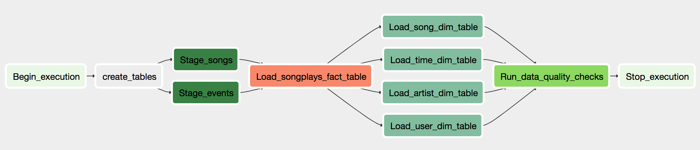

# Sparkify: Data Pipeline with Airflow Project

## Summary

Sparkify wants to analyze the data they've been collecting on songs and user activity on their new music streaming app. They have decided to use Apache Airflow to introduce more automation and monitoring to their data warehouse ETL pipelines.

The source data resides in S3 and needs to be processed in Sparkify's data warehouse in Amazon Redshift. The source datasets consist of JSON logs that tell about user activity in the application and JSON metadata about the songs the users listen to.

**Task**: build a data pipeline with DAG showing below which has custom operators to perform tasks that can stage the data, transform the data in data warehouse, and run checks on data quality




## Database Schema

**Datasets & Location**:

Song data: `s3://udacity-dend/song_data` <br>
Log data: `s3://udacity-dend/log_data` <br>
Log data json path: `s3://udacity-dend/log_json_path.json`

  \
The star schema includes 1 Fact Table and 4 Dimension Tables.

**Fact Table**

- `songplays` <br>
songplay_id, start_time, user_id, level, song_id, artist_id, session_id, location, user_agent

**Dimension Tables**

- `users` <br>
user_id, first_name, last_name, gender, level

- `songs` <br>
song_id, title, artist_id, year, duration

- `artists` <br>
artist_id, name, location, latitude, longitude

- `time` <br>
start_time, hour, day, week, month, year, weekday


## Files in Repository

- `README.md` <br>
brief intro of the project
- `__init__.py` <br>
help Python import packages

/dags
- `udac_example_dag.py` <br>
script with the DAG, tasks, and task dependencies that can copy song and log data from S3 to staging tables in Redshift, transform the data into fact and dimension tables in Redshift, and run checks on data quality of all tables
- `create_tables.sql` <br>
contain SQL queries to drop old staging, fact, and dimension tables if exist and create new ones in Redshift

/helpers
- `sql_queries.py` <br>
contain SQL queries to transform and insert data into fact and dimension tables

/operators
- `stage_redshift.py` <br>
script to create `StageToRedshiftOperator` that loads JSON formatted files from S3 to staging tables in Amazon Redshift
- `load_fact.py` <br>
script to create `LoadFactOperator` that transforms data in staging tables and inserts into fact table in Amazon Redshift; data is appended into fact table
- `load_dimension.py` <br>
script to create `LoadDimensionOperator` that transforms data in staging tables and inserts into dimension tables in Amazon Redshift; tables are emptied before inserting data
- `data_quality.py` <br>
script to create `DataQualityOperator` that checks if staging, fact, and dimension tables contain at least 1 row of data


## How to Run

1. Run `start.sh` command to start the Airflow web server to access the Airflow UI

2. Create an IAM user with `AmazonS3ReadOnlyAccess` and `AmazonRedshiftFullAccess` permissions, download credentials file

3. Launch a cluster in Amazon Redshift, set Cluster identifier as redshift, Database name as udacity, Master user name as awsuser

4. On Airflow UI, click `Admin->Connections->Create` to create 2 connections to configure AWS credentials and connection to Redshift

```
aws_credentials

Conn Id: aws_credentials
Conn Type: Amazon Web Services
Login: Enter Access key ID from the IAM User credentials file
Password: Enter Secret access key from the IAM User credentials file

redshift

Conn Id: redshift
Conn Type: Postgres
Host: Enter the endpoint of your Redshift cluster, excluding the port at the end
Schema: udacity
Login: awsuser
Password: Enter the password you created when launching your Redshift cluster
Port: 5439
```

5. On Airflow UI, start the DAG, click Graph View to see task status

6. If all completed tasks have dark green outline border, the DAG succeeded; if any task failed, click the task->View Log to see the error

7. When you finished, pause the DAG and delete the Redshift Cluster you created to avoid unnecessary cost
