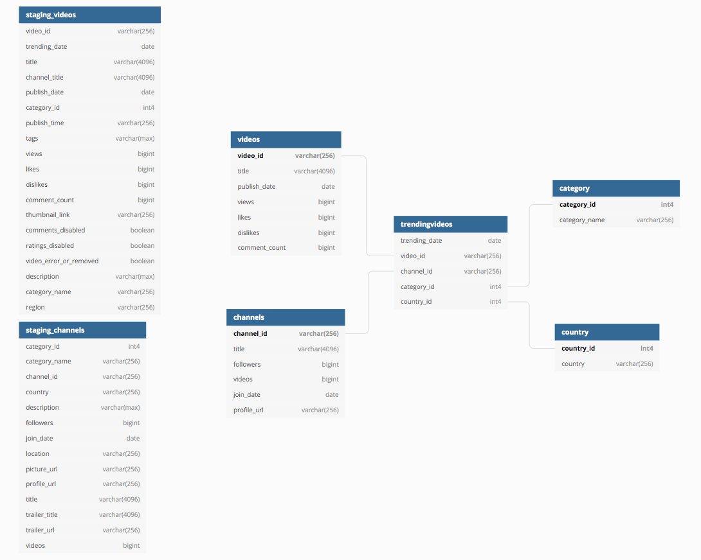
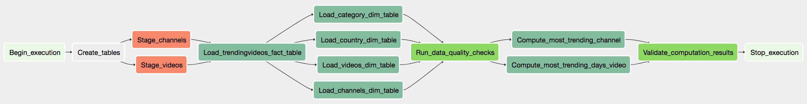

# Capstone Project: YouTube Trending Videos ETL Pipeline

## Summary

An ETL data pipeline which has custom operators to perform tasks that can extract data from S3 to data warehouse in Redshift, transform the data in data warehouse, run checks on data quality, compute results for analytical questions, and run checks on final results.

Data sources:

1. Daily record of up to 200 top trending YouTube videos during 11/14/2017 - 6/14/2018: https://www.kaggle.com/muskangoyal2104/youtubedata
2. List of all YouTube channels created during 7/21/2005 - 10/12/2018: https://www.kaggle.com/babikov/youtube-channels-100000

This data is prepared for analysis to answer questions such as:

- Which YouTube video remained the most days on the trending videos list?
- Which YouTube channel has the largest number of trending videos?

Some examples for other questions it can also answer:
- On average, how many views / likes / dislikes / comments does each trending YouTube video get?
- What are Top X categories of trending YouTube videos?
- What are Top X countries that have the most views / likes / dislikes / comments from trending YouTube videos?
- What are Top X YouTube channels that have the most followers / posted the most videos?


## Data Assessment

- Same `video_id` can have more than 1 `category_name` and `region` in `staging_videos` table

- `region` column in `staging_videos` table only has 10 countries: United States, Canada, Great Britain, France, Germany, Mexico, Japan, South Korea, India, Russia. `country` dimension table coded the 10 countries with `country_id` 1-10 in above listed order. `country` column in `staging_channels` table has 203 countries

- `tags` and `description` columns in `staging_videos` table, as well as `country` and `description` columns in `staging_channels` table contains `null` value; `location` column in `staging_channels` table is empty

- Some values in `title` and `channel_title` columns in `staging_videos` table, as well as in `title` and `trailer_title` columns in `staging_channels` table are longer than varchar(256), so their length has been set to varchar(4096); some values in `tags` and `description` columns in `staging_videos` table, and `description` column in `staging_channels` table are super long, therefore their length has been set to varchar(max)

- Currently, the source data is two CSV files. It would be better if the data is pulled through YouTube APIs so that data can be up-to-date


## Data Model

Below Entity Relationship Diagram (ERD) shows the data model used. Star schema is chosen to help answer the analytical questions above.

Two staging tables on the left represent the data from the source CSV files. Tables on the right represent the fact table `trendingvideos` and 4 dimension tables.




## ETL Pipeline

The ETL (extract-transform-load) pipeline is ran via an Airflow DAG:



The DAG includes following tasks/steps:

1. Extract data from the 2 CSV files in S3 into 2 staging tables in Redshift; one for trending YouTube videos data and one for YouTube channels.

2. Load data into 1 fact table `trendingvideos`, and 4 dimension tables `videos`, `channels`, `category`, `country`

3. Check data quality of all tables to ensure data is loaded in and there is at least one row of data

4. Compute results for "*Which YouTube video remained the most days on the trending videos list?*" and "*Which YouTube channel has the largest number of trending videos?*" by joining data from fact and dimension tables, and store results in `most_trending_days_video` and `most_trending_channel` tables

5. Run final data validation check on the 2 analytical tables to ensure there is data

The data is supposed to be updated daily so I set up the Airflow schedule to run daily at midnight and retry 3 times every 5 minutes.

Airflow SLA is also added such that each task in the DAG needs to complete within 1 hr, and if any task violated the SLA or if DAG fails, an alert email will be sent.


## Files in Repository

- `README.md` <br>
brief intro of the project
- `__init__.py` <br>
help Python import packages

/dags
- `youtube_trending_videos_dag.py` <br>
script with the DAG, tasks, and task dependencies that can extract data from S3 to data warehouse in Redshift, transform the data in data warehouse, run checks on data quality, compute results for analytical questions, and run checks on final results
- `create_tables.sql` <br>
contain SQL queries to drop old staging, fact, and dimension tables if exist and create new ones in Redshift

/helpers
- `sql_queries.py` <br>
contain SQL queries to transform and insert data into fact, dimension, analytical tables

/operators
- `stage_redshift.py` <br>
script to create `StageToRedshiftOperator` that loads JSON formatted files from S3 to staging tables in Amazon Redshift
- `load_table.py` <br>
script to create `LoadTableOperator` that transforms data in staging tables and inserts into fact, dimension, analytical tables in Amazon Redshift; tables are emptied before inserting data
- `data_quality.py` <br>
script to create `DataQualityOperator` that checks if staging, fact, dimension, analytical tables contain at least 1 row of data


## How to Run

**Run this project for the first time**

1. Set up to run Airflow locally

```
# create a new environment using conda
conda create --name airflow-env

# start new environment
source activate airflow-env

# set AIRFLOW_HOME environment variable
export AIRFLOW_HOME= /Users/yuxiao/airflow

# install airflow using pip
pip install apache-airflow

# install boto3
pip install boto3

# install postgres
pip install apache-airflow[postgres]

# initialize the database
airflow initdb

# check what are in the airflow directory
ls -al ~/airflow

# create a local dag folder
mkdir ~/airflow/dags

# start the web server, default port is 8080
airflow webserver -p 8080

# open Airflow UI http://localhost:8080

# start the scheduler
airflow scheduler
```

2. Create an IAM user with `AmazonS3ReadOnlyAccess` and `AmazonRedshiftFullAccess` permissions, download credentials file

3. Launch a cluster in Amazon Redshift, set Cluster identifier as redshift, Database name as udacity, Master user name as awsuser

4. On Airflow UI, click `Admin->Connections->Create` to create 2 connections to configure AWS credentials and connection to Redshift

```
aws_credentials

Conn Id: aws_credentials
Conn Type: Amazon Web Services
Login: Enter Access key ID from the IAM User credentials file
Password: Enter Secret access key from the IAM User credentials file

redshift

Conn Id: redshift
Conn Type: Postgres
Host: Enter the endpoint of your Redshift cluster, excluding the port at the end
Schema: udacity
Login: awsuser
Password: Enter the password you created when launching your Redshift cluster
Port: 5439
```

5. On Airflow UI, start the DAG, click Graph View to see task status

6. If all completed tasks have dark green outline border, the DAG succeeded; if any task failed, click the task->View Log to see the error

7. When you finished, pause the DAG and delete the Redshift Cluster you created to avoid unnecessary cost


## Scenarios

- Data increased by 100x
  - Scale both the size and number of nodes in Redshift cluster
  - Some tweaks may also need to be made, e.g. setting the distribution style of `videos` and `channels` dimension tables to Key distribution, and setting `category` and `country` dimension tables to All distribution may reduce the amount of data shuffling and improve query run time performance

- Database needs to be accessed by 100+ people
  - Redshift should have no problem handling 100+ database users with auto-scaling capabilities and good read performance
